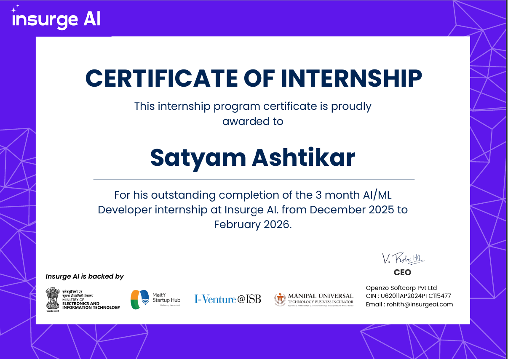
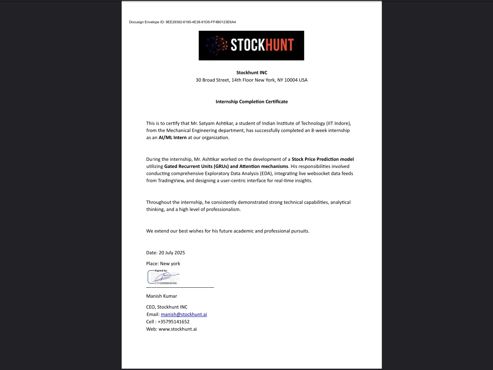
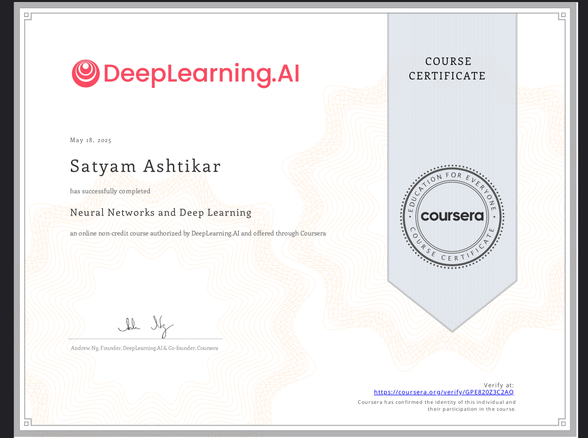
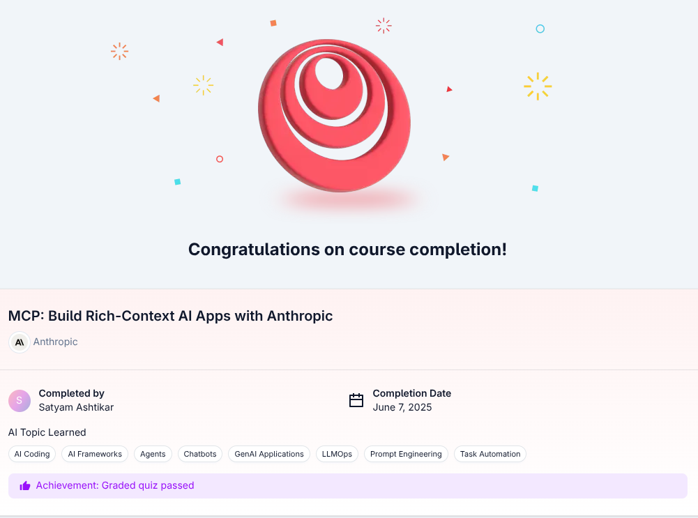
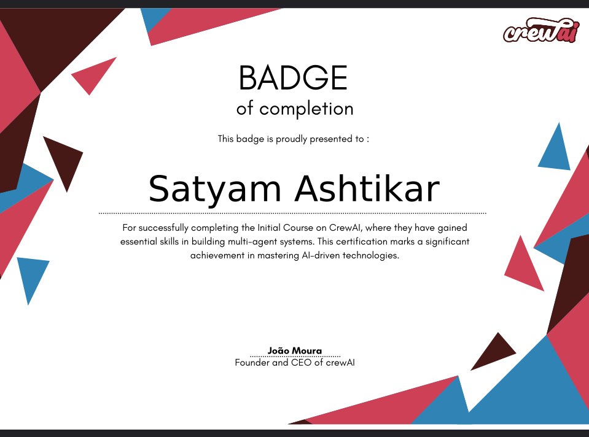
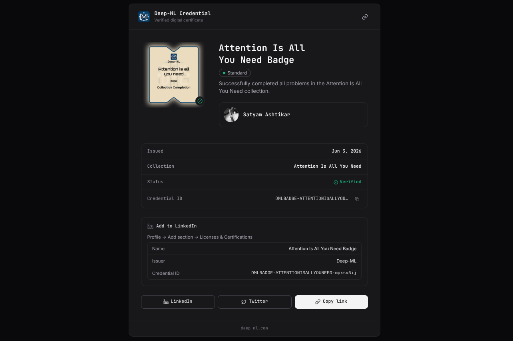
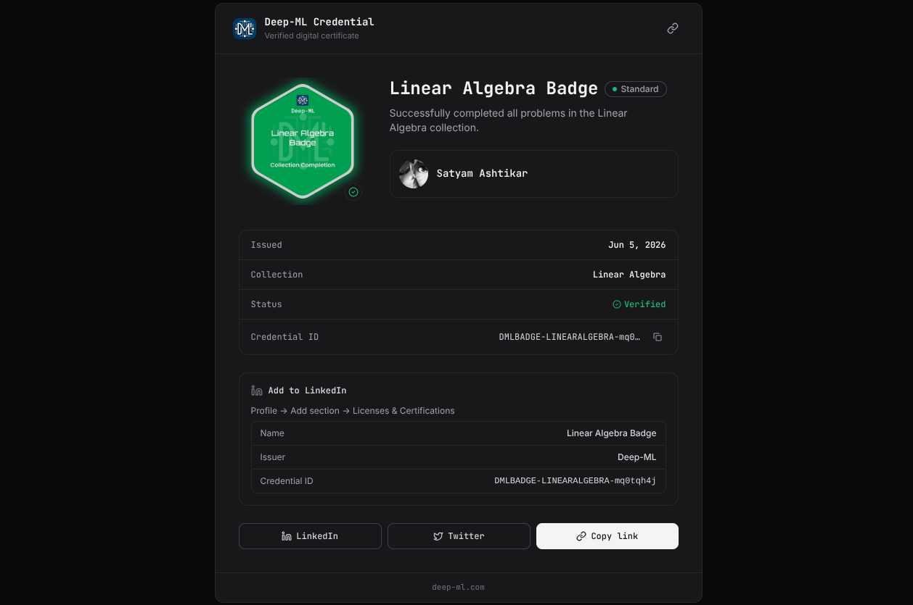

  
   
   
  

# Hi there, I'm Satyam Ashtikar 👋
## About Me

I am a pre-final year **B.Tech Mechanical Engineering** student at **IIT Indore**, originally from Pune, Maharashtra. I am deeply passionate about building intelligent systems and scalable pipelines. My primary focus lies in **Generative AI**, **NLP with LLMs**, and high-performance **Computer Vision**. I love exploring new AI tools and constantly learning about **System Design** and **Backend Development** to build robust architectures. When I'm not coding, you'll likely find me playing chess or football, or out hiking and exploring historic forts :)

## 💼 Experience

During my professional journey, I have had the opportunity to contribute to impactful roles in AI and Data Science:
- **ML & DevOps Intern @ Insurge AI** *(Dec 2025 – Mar 2026)*  
  Engineered scalable agentic pipelines on a cloud backend utilizing WebSockets for real-time responsiveness, and applied transfer learning to fine-tune advanced Text-to-Speech architectures alongside robust Speech-to-Text integration for highly optimized, low-latency audio streaming.

- **Data Scientist Intern @ Stockhunt INC.** *(May 2025 – July 2025)*  
  Developed sophisticated Attention and LSTM time-series models for high-frequency algorithmic trading by building data pipelines for live ticker streaming, fusing these quantitative features with news sentiment analysis to power robust rolling-forecast systems.

## 🌟 Open Source & Achievements

- **PyTorch Contributor**: Actively contributed to the core PyTorch library by fixing missing allocator guards in `torch.accelerator.memory` to resolve RuntimeError crashes ([PR #186269](https://github.com/pytorch/pytorch/pull/186269)).
- **Leadership**: Serving as the Head of the Machine Learning Domain at Google Developer Groups (GDG), IIT Indore, and Co-Head at Cynaptics Club.
- **Bronze Medal @ Inter IIT**: Clinched the Bronze Medal at the prestigious Inter IIT Tech Meet 14.0, achieving an impressive 9th place overall rank among all IITs in the project category.
- **Bronze Medal @ IITI SoC**: Won Bronze at the IITI Summer of Code (among 100+ teams and 400+ participants).
- **Gold Medal @ Hacksync 26**: Engineered SwipeHire, a Tinder-style job app featuring semantic matching and OCR, winning Gold among 25+ teams.
- **Competitive Programming**: Solved 300+ advanced algorithmic problems across platforms.
  - **LeetCode**: [@WhileTrueSatty](https://leetcode.com/u/WhileTrueSatty/)
  - **Codeforces**: [@Satty80085](https://codeforces.com/profile/Satty80085) (Max 1220, Pupil)
  - **Deep-ML**: [@Satyam Ashtikar](https://www.deep-ml.com/profile/F7UE7evmlJfuJ2ujaFYZgZI5PAJ2)

## 🚀 Featured Projects

- **Attira AI - Virtual Try-On Platform**  
  A state-of-the-art virtual try-on platform that significantly outperforms commercial models in image realism. It is powered by an advanced agentic pipeline utilizing FLUX Fill + Redux alongside a fine-tuned SegFormer B2. Optimized with FP8 quantization & regional compilation to cut cold-starts 6x on Modal Labs.  
  [Website](https://attira-nu.vercel.app) | [Docs](https://attira-nu.vercel.app/docs) | [GitHub](https://github.com/YashBhamare123/TryOnPort)

- **Causal Flux - Hybrid Vector + Graph RAG**  
  A causality-aware RAG to analyze complex service transcripts. Leverages multi-hop reasoning via agents, cross-encoder reranking, PPR, and agglomerative clustering for optimal retrieval, validated by rigorous ablation studies.  
  [Demo](https://www.youtube.com/watch?v=5CY9jB4rwU4) | [GitHub](https://github.com/ThunderBolt4931/Causal-Flux)

- **Voice and Gesture Control on Cobot**  
  A real-time visual servoing & intent classification system fusing YOLO and visual agents. Achieves ultra-low latency by bypassing ROS via a custom TCP/IP SDK, featuring an autonomous pipeline driven by STT & streaming ML.  
  [Blog](https://addverb.ai/blog/voice-and-gesture-control-on-a-cobot-iit-indore-addverb-syncro-5) | [GitHub](https://github.com/CoderSATTY/Cobot-processing)

- **Voiz AI - Conversational Voice Pipeline**  
  An end-to-end voice-to-voice AI enabling natural real-time interactions. Powered by AI agents for low-latency audio processing, bridging advanced speech recognition with highly expressive text-to-speech in a single fluid stream.  
  [Demo](https://www.youtube.com/watch?v=Raw870zI6Jg) | [GitHub](https://github.com/CoderSATTY/Voice-to-Voice)

- **SwipeHire - Tinder-style Job Matches**  
  A Tinder-style job platform (Gold at Hacksync 26), matching candidates via semantic search, RAG, & OCR. Uses a custom JobSpy MCP to scrape and deliver highly personalized job matches tailored dynamically to user activity.  
  [Website](https://swipehire-lime.vercel.app/) | [GitHub](https://github.com/CoderSATTY/Jobs-Tinder)

- **Edigen AI - Editing & Image Generation Platform**  
  An editing and image generation platform optimized for low inference on edge devices. It utilizes advanced model pruning & knowledge distillation to cut computational overhead while maintaining high fidelity.  
  [GitHub](https://github.com/ThunderBolt4931/Edigen-AI)

- **Assignment Solver - Automated Homework Agent**  
  An intelligent automation agent that parses and solves academic tasks. Integrates an agentic system, Classroom MCP, multimodal extraction, and LLM reasoning to generate step-by-step solutions directly from documents.  
  [GitHub](https://github.com/CoderSATTY/Assignment_solver)

- **JoSH AI - JoSAA Student Helper**  
  An AI assistant decoding JoSAA counseling using official OR-CR data. Powered by an agentic RAG system (FastAPI, Groq LLM) with real-time web search to deliver fast, source-backed insights for category-specific queries.  
  [Website](https://josh-ai-gilt.vercel.app/)

- **LeetComp AI - LeetCode Personalized Hint Recommender**  
  An industry-grade AI Tutor Chrome extension serving daily active users with real-time coding guidance. Actively assists competitive programmers with dynamic hints & algorithmic insights directly inside their browser environment.  
  [Chrome Extension](https://chromewebstore.google.com/detail/dpmibfgdhdmhljnobomioehgbdmmepkd) | [GitHub](https://github.com/CoderSATTY/leetcomp)

- **Gesture Controller - Dr. Driving Game**  
  A computer vision-based gesture recognition system letting users play "Dr. Driving" via hand movements. Utilizes MediaPipe & OpenCV to map physical gestures into in-game controls for an immersive, hands-free experience.  
  [GitHub](https://github.com/CoderSATTY/Gesture-Controller-for-Dr.-Driving)

... And many more [Here](https://github.com/CoderSATTY?tab=repositories)!  

## 🏆 Certifications

<table align="center">
  <tr>
    <td align="center" width="33%">
      
       <b>InsurgeAI</b>
    </td>
    <td align="center" width="33%">
      
       <b>StockHunt</b>
    </td>
    <td align="center" width="33%">
      
       <b>Neural Networks & Deep Learning</b>
    </td>
  </tr>
  <tr>
    <td align="center" width="33%">
      
       <b>Model Context Protocol</b>
    </td>
    <td align="center" width="33%">
      
       <b>Agentic AI</b>
    </td>
    <td align="center" width="33%">
      
       <b>Attention in Transformers:PyTorch</b>
    </td>
  </tr>
  <tr>
    <td align="center" width="33%">
      
       <b>Attention Mechanism</b>
    </td>
    <td align="center" width="33%">
      
       <b>Linear Algebra</b>
    </td>
    <td align="center" width="33%">
    </td>
  </tr>
</table>

## 🛠️ Tech Stack

### Programming Languages

### Data Science & Analysis

### Web Development

### Deep Learning & AI Frameworks

### Generative AI & LLMs

### Computer Vision & Detection

### AI Agents & Automation

### Databases & Storage

### Development Tools

### UI Frameworks & Tools

### Deployment Platforms

### Infrastructure & Orchestration

## 📫 Connect with Me

- Email: sattyashtikar@gmail.com
- LinkedIn: [Satyam Ashtikar](https://linkedin.com/in/satyam-ashtikar/)
- GitHub: [@CoderSATTY](https://github.com/CoderSATTY)

---

